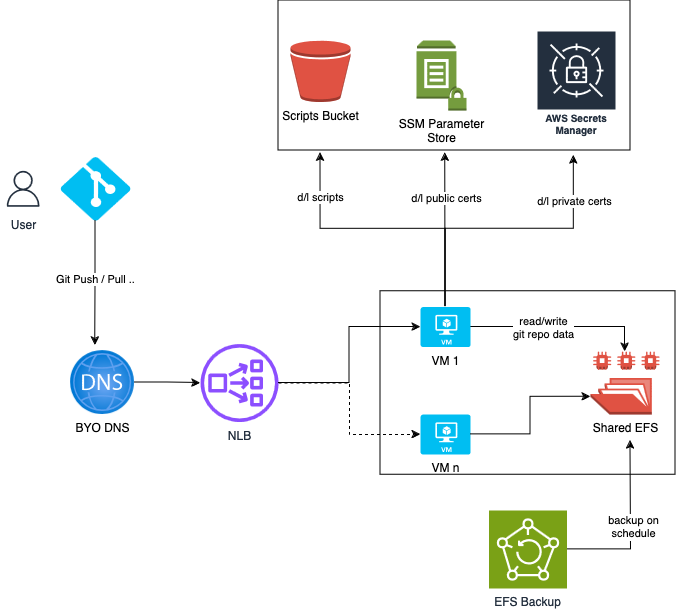
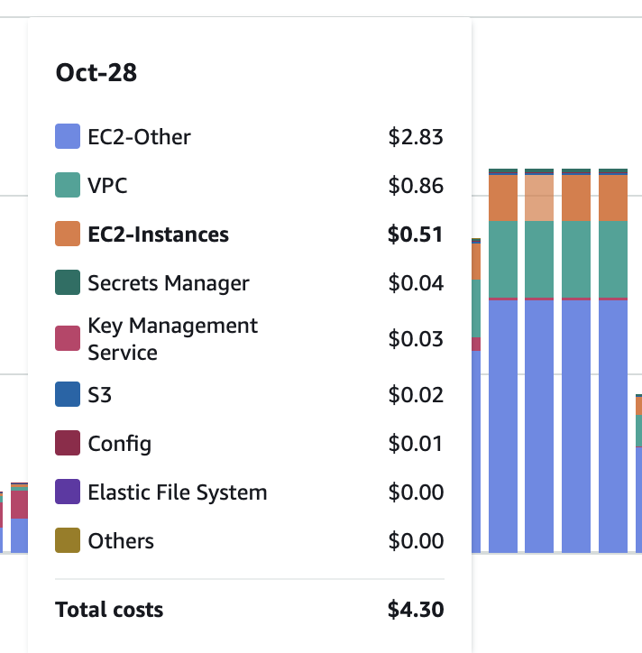

# TrunkHub CDK

Build a run your own Git Server in the cloud that only accepts default (trunk/main) branch pushes.

No web interface, just a robust git server hosted in the cloud.

## Deploying From Scratch

(MacOS)
1. Clone the this repository
1. Set up Python and Node  `.tool-versions` file for suggested versions (via your favorite version manager or `brew`)
1. Run `npn install`
1. Install Checkov `brew install checkov`
1. Authenticate into your AWS account and ensure `AWS_ACCOUNT_ID` is set in your environment
1. Generate ssh keys by running `./bin/gen-keys.sh`
1. In `lib/scripts/user-data.sh` file look for `# Configure who has access` comment and put you public key or repeat the line with whoever public keys need access.
1. Optional: generate Cloudforamtion and check for any security issues `npx cdk synth && checkov`
1. Deploy VPC stack eg `npx cdk deploy trunk-hub-vpc-prod`
1. Deploy the App stack `npx cdk deploy trunk-hub-app-prod`
1. Upload the public keys to parameter store and private keys to secrets manager `./bin/upload-keys.sh`
1. Terminate any existing EC2 instances - they need to recreate to download the uploaded keys on boot.
1. Optional: `CNAME` your DNS to the Network Load balancers DNS name. eg `www.trunk-hub.com CNAME> trunk--appnl-HEAf6aOVL6kL-7ed5b8acd25cae90.elb.ap-southeast-2.amazonaws.com` - No Route53 configuration is included here.
    * If you don't do this step then you will need to use the NLB ip or long DNS name of the NLB to connect.
1. Connect with session manager to any EC2 instance and run `new-git-repo foobar` to make a new source repo.
1. Add _your_ private key to your ssh agent the one that corresponds to the public key you put in the `user-data` file
1. Clone the repo locally to test `git clone git@trunk--appnl-HEAf6aOVL6kL-7ed5b8acd25cae90.elb.ap-southeast-2.amazonaws.com:/srv/git/foobar.git`
1. Make a commit and push to test it works
1. Make a branch and push to test it is rejected :)

## TODO:
- [ ] GitHub Actions for linting
- [ ] GitHub Action for testing CDK
- [ ] Source public keys from somewhere in AWS so it pulls them in on boot.
- [ ] Only allow git ssh command not a ssh interactive shell
- [ ] more CDK tests
- [ ] Architecture Diagrams
- [ ] Code linting
- [ ] Figure out how to do configure a push hook to trigger
- [ ] use https://fck-nat.dev/v1.3.0/ instead of managed NAT(? reduce costs)

# Basic Architecture


# Stacks
## trunk-hub-vpc-dev|prod
This is a AWS VPC based of the CDK VPC construct in CDK. It is a simple VPC with 2 public and 2 private subnets. It is configured for Session Manager access including the necessary rules to allow the AWS Session Manager to connect to private and public instances.

If you have a VPC already you can use that instead of creating a new one. You will need to provide the required VPC inputs.

TODO: Architecture Diagram and VPC outputs needed for the App stack.

## trunk-hub-app-dev|prod

This is the main stack that creates the configuration to host the git server. It creates the following resources:
- EC2 instance with the git server installed (Amazon Linux 2)
- Network Load Balancer
- S3 Bucket for backups / logging
- EFS for shared storage

TODO: Architecture Diagram and how to define the VPC inputs if not using the VPC stack.

## trunk-hub-backup-dev|prod

This is the stack you can use to backup the EFS file system. It will use the same KMS Key from the App stack to encrypt the backups. (TODO: Maybe use a different key?)

In the EFS CDK construct you can enable backups via a simple parameter. We've chosen to create a separate stack so that ou can configure your own schedule to suite your needs / risk profile.

This stack will create:
- Back Up Vault
- Back Up Plan

This stack needs several inputs. The EFS file system ID and the KMS Key ID.


### SSH Keys

To ensure the host keys stay the same no matter which EC2 instance you ssh to, you will need to regenerate several keys and upload them to the SSM Parameter Store.

To generate all the keys if you're starting from scratch use this script:

```bash
./bin/gen-keys.sh
```

This will create a keys directory with both the private and public keys. This directory should be ignored by git.

Once you have deployed the app stack you can then upload the keys via:

```bash
./bin/upload-keys.sh
```

### BYO VPC?
TODO: If so these are the params the app stack needs.
If not, deploy the VPC stack first.

### Deploy the App Stack
TODO: instructions on how to deploy the app stack

What about DNS? BYO or use Route53 and point to NLB

## Cost


Approx 5US$ per day for all stacks.

> [!NOTE]
> YMMV - The cost of data storage and data transfer will increase this of course.

## Changelog
This project uses a CHANGELOG.md file to keep track of changes.
Based on the [Keep a Changelog](https://keepachangelog.com) format.

## Useful Commands

* `npx cdk bootstrap aws://<acc-number>/<region>` cdk bootstrap
* `npx cdk list`    list stacks
* `npm run build`   compile typescript to js
* `npm run watch`   watch for changes and compile
* `npm run test`    perform the jest unit tests
* `npx cdk deploy`  deploy this stack to your default AWS account/region
* `npx cdk diff`    compare deployed stack with current state
* `npx cdk synth`   emits the synthesized CloudFormation template

To stop asking for approval to change and deploy use `--require-approval never` flag.

## Connecting to Git Servers
The VPC the app is deployed into should alow for AWS Session Manager to be used to connect to the servers.

See [AWS Session Manager](https://docs.aws.amazon.com/systems-manager/latest/userguide/session-manager.html) and [VPC Setup](https://docs.aws.amazon.com/systems-manager/latest/userguide/setup-create-vpc.html).

If you have the aws cli installed you may need to install the session manager plugin.

```bash
# For MacOS
brew install session-manager-plugin

# To connect
aws ssm start-session --target your-instance-id
```

For other operating systems please see the [AWS Session Manager Plugin](https://docs.aws.amazon.com/systems-manager/latest/userguide/session-manager-working-with-install-plugin.html)

If you BYO AWS VPC you will need to ensure its configured for Session Manager access.

## Security

Using `checkov` for security scanning.

There is a configuration file in the root of the project with all the options for checkov to run. `./checkov.yaml`

```bash
# Install checkov
brew install checkov
# Run checkov
checkov
```

### Checkov Exceptions

Each stack in this project has a corresponding file in the `exceptions/` directory. You pass in the item into a function from the main stack file.
```typescript
import { applyCheckovSkips } from './exceptions/trunk-hub-app-stack-ex';

// rest of the code

applyCheckovSkips(s3Bucket);
```

Then in the exception file you can add the metadata as shown below.

```typescript
const cfnS3Bucket = s3Bucket.node.defaultChild as s3.CfnBucket;
cfnS3Bucket.cfnOptions.metadata = {
    'checkov': {
        'skip': [
            {
                'id': 'CKV_AWS_ID',
                'comment': 'Reason for skipping'
            },
        ]
    }
}
```

Some times it might not be straight forward to apply a skip to a resource. Especially when deploying constructs that add lambdas to perform certain actions like clean up buckets or change security group rules for the VPC deployment.

Until a better way is discovered that can fit with the above pattern we can use the `.checkov.baseline` file to skip checks.

To regenerate the baseline file run the following command:

```bash
npx cdk synth

checkov --create-baseline
```
This will create the a `.checkov.baseline` in the `cdk.out/` directory. You will need to copy and pase the new skipped checks int the `.checkov.baseline` file in the root of the project.

## Recording Architecture Decisions

We use [adr-tools](https://github.com/npryce/adr-tools) to record our Architecture Decision Records (ADRs).

More context on ADRs please read [this](https://cognitect.com/blog/2011/11/15/documenting-architecture-decisions).
